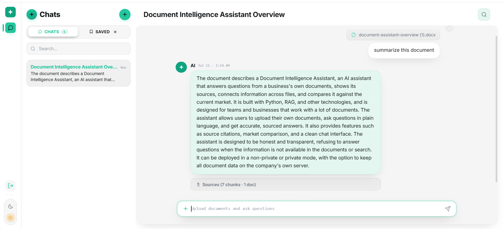

# RAG Document Assistant

An AI assistant that answers questions from your own documents and shows exactly where each answer came from. Built on Retrieval-Augmented Generation (RAG): it reads your uploaded files (PDF, Word, Excel, CSV), finds the relevant parts, and answers only from those, instead of guessing from general knowledge like a normal chatbot. When the answer is not in your files, it says so instead of making one up.

It also runs multiple separate chats, like ChatGPT, where each chat keeps its own uploaded documents isolated from the others, and it can pull live web results to compare your data against the current market.

The backend is architected for 100–1000 concurrent users rather than a single-user demo: API processes hold no local state, document ingestion runs on separate workers, the request path is async end to end, and every session is rate limited. See [Scaling & Production Architecture](#scaling--production-architecture) for the reasoning behind each piece.



## Features

- **Answers from your documents.** Every answer comes from your uploaded files, not general knowledge.
- **Source citations.** Each answer shows the document and section it came from, so you can verify it.
- **Connects across files.** A single answer can combine facts from several documents at once, for example a ranking from a PDF and a figure from a spreadsheet.
- **Handles real files.** PDF, Word, Excel, and CSV.
- **"I don't know" honesty.** If the answer is not in your files or the web search, it says so instead of inventing one.
- **Market comparison.** Optional live web search to compare document data against the current market, with the sources it used shown.
- **Multiple isolated chats.** Separate conversations, each with its own documents, kept apart from each other.
- **Background ingestion.** Uploads return immediately; parsing and embedding run on a Celery worker while the UI polls for completion.
- **Rate limiting and token budgets.** Per-session request limits and optional hourly/daily token caps, enforced in Redis.
- **Light and dark theme.** No flash of the wrong theme on load.
- **No login needed.** Each browser tab gets a private, temporary session that clears when you leave.

## Architecture

```
React ──HTTP──▶ FastAPI (async, N uvicorn workers)
                  │  ├─ chats, rate limits, token usage ──▶ Redis
                  │  ├─ query embeddings + vector search ──▶ Pinecone
                  │  ├─ answer generation (AsyncGroq) ────▶ Groq API
                  │  └─ upload → enqueue task ────────────▶ Redis (Celery broker)
                  │                                            │
                  └─ GET /api/upload/status/{task_id} ◀── Celery worker
                                                              parse → chunk → embed → upsert to Pinecone
```

Nothing is stored on the API's local disk, so any number of API workers and Celery workers can run side by side.

## How It Works

**Indexing (once per document set, on the Celery worker):**

1. The upload endpoint validates chat ownership and size, queues a task, and returns `202 {task_id}` immediately.
2. The worker parses documents: pypdf for PDFs, python-docx for Word, and pandas for Excel and CSV.
3. Text is split into overlapping, paragraph-packed chunks (about 800 characters, 150 overlap).
4. Each chunk is embedded with a local Hugging Face model (all-MiniLM-L6-v2, 384 dimensions).
5. Vectors are upserted into Pinecone, in a namespace per chat, with metadata `text`, `source`, `chunk_index`, `uploaded_at`, `chat_id`, `session_id`.
6. The frontend polls `GET /api/upload/status/{task_id}` until it reports `success`.

**Query (per question):**

1. The request passes the per-session rate limit and token budget checks (Redis).
2. The question is embedded with the same model.
3. Pinecone returns the nearest chunks by cosine similarity, scoped to the chat's namespace and filtered on `chat_id`.
4. The retrieved chunks and the question are composed into a grounded prompt.
5. Groq generates the answer using only that context. Token usage is recorded in Redis.
6. The answer is returned with its source document and section shown.

## Tech Stack

| Layer | Choice | Why |
|---|---|---|
| Frontend | React (Create React App), plain CSS with a design-token system | A single-page chat UI with no server rendering needs; tokens keep light and dark themes consistent. |
| Backend | FastAPI (Python, async) + Uvicorn | Native `async def` routes, so one process serves many requests that are waiting on the LLM or network. |
| Background jobs | Celery | Moves CPU-heavy ingestion out of the API process, so an upload never stalls other users' questions. |
| Broker / state | Redis | One fast, shared store that serves as the Celery broker, holds chat state and rate-limit counters, and backs the planned response cache. |
| Loading | pypdf, python-docx, pandas | Standard, dependable parsers for each supported format; pandas keeps spreadsheet rows intact. |
| Embeddings | Hugging Face all-MiniLM-L6-v2 (runs locally) | Small (384-dim), fast on CPU, and free per call, since Groq has no embedding endpoint. |
| Vector store | Pinecone (serverless) | Managed and network-accessible, so every API and worker process reads and writes the same index concurrently. |
| Generation | Groq API: llama-3.3-70b-versatile (documents), compound-beta (web search) | Low-latency hosted inference; compound-beta adds built-in live web search. |

## Scaling & Production Architecture

The original version ran as one process with everything on local disk: ChromaDB for vectors, a JSON file for chats, and parsing and embedding inside the upload request. That is fine for one user and falls over for many. Each change below removes a specific bottleneck to supporting concurrent users.

### Decoupling ingestion from querying (Celery)

Ingesting a document is the most expensive thing the system does: parsing a large PDF or spreadsheet, chunking it, and running every chunk through the embedding model is CPU-bound and can take many seconds. Done inside the request, that work occupies an API worker for its whole duration, so one user uploading a large file slows down everyone else's questions, and a burst of uploads can exhaust the API entirely. Ingestion and querying also have opposite profiles: ingestion is heavy, rare, and can tolerate delay; querying is light, frequent, and latency-sensitive. Putting ingestion on a Celery queue lets each scale independently. The upload endpoint only validates and enqueues, returning `202` with a task id, and workers drain the queue at their own pace. Adding throughput for uploads means adding workers, not API servers. `task_acks_late` means a task whose worker crashes is redelivered, not lost.

### Moving the vector store off local disk (Pinecone)

ChromaDB in persistent mode keeps its index on the local filesystem of the process that opened it. That ties the vector store to a single machine and a single writer: a second API instance or a separate ingestion worker cannot safely share it, concurrent writes from several processes risk corruption, and the index is limited by that one host's memory and disk. Pinecone is a network service, so every API worker and every Celery worker reads and writes the same index concurrently, and it scales storage and query throughput independently of the app servers. Per-chat isolation carries over: each chat is its own namespace, and each query still filters on `chat_id` metadata.

### Async request handling (async FastAPI)

The chat endpoint spends almost all of its time waiting: on Redis, on Pinecone, and above all on the LLM, which can take several seconds per answer. With synchronous route handlers, each in-flight request holds a thread for that entire wait. FastAPI runs sync handlers in a thread pool of about 40 threads per process, so roughly 40 slow LLM calls saturate a worker, and every further request queues behind them regardless of how idle the CPU is. With `async def` handlers and async clients (`AsyncGroq`, `redis.asyncio`), a waiting request yields the event loop instead of holding a thread, so one process can keep hundreds of requests in flight. Calls that have no async client (the Pinecone SDK) or are CPU-bound (query embedding) run in a thread pool via `asyncio.to_thread` so they never block the loop.

### Caching repeated queries (Redis)

Under real load, many requests repeat: the same question asked again in a chat, the same follow-up after a reload, the same query embedding computed twice. Each repeat costs an embedding pass, a Pinecone query, and an LLM call, and the LLM call dominates both latency (seconds) and cost (tokens against a per-minute quota). A Redis cache keyed on chat id, document set, and normalized question returns a stored answer in about a millisecond and spends no tokens, so under repeated load it cuts both response time and provider spend. Redis is already deployed for the broker and rate limiter, so the cache needs no new infrastructure. The answer cache itself is the next step on the roadmap; today Redis holds shared chat state, rate-limit counters, and token usage.

### Rate limiting (Redis)

Rate limiting protects two things. First, the API: without a limit, one client, whether buggy, abusive, or just a stuck retry loop, can consume capacity that every other user shares. Second, and just as important, the LLM provider's quota: the Groq account has a fixed tokens-per-minute ceiling that is shared across all users, so one heavy session can exhaust it and turn everyone else's requests into provider errors. The limiter counts requests per session per minute and tracks token usage per session per hour and per day, using atomic Redis counters that are consistent across every API worker. Over the limit, the API returns `429 Too Many Requests` with a `Retry-After` header, so clients back off predictably instead of retrying blindly. All limits are configurable through environment variables.

## Getting Started

### Prerequisites

- Python 3.10 or newer
- Node.js 18 or newer
- Docker (for Redis, or the whole backend stack)
- A Groq API key (free tier works), from console.groq.com
- A Pinecone API key, from app.pinecone.io

### 1. Configure

```bash
cp backend/.env.example backend/.env   # then fill in GROQ_API_KEY and PINECONE_API_KEY
```

### 2. Create the Pinecone index (once)

```bash
cd backend
pip install -r requirements.txt
python -m src.vectorstore      # creates the index if missing; safe to re-run
```

### 3a. Run the backend with Docker Compose (recommended)

```bash
docker compose up --build      # redis + api (port 8000) + celery worker
```

### 3b. Or run it locally

```bash
docker compose up -d redis                       # or any local Redis on :6379

cd backend
python -m venv venv
source venv/bin/activate                         # Windows: venv\Scripts\activate
pip install -r requirements.txt

uvicorn main:app --reload                        # terminal 1: API
celery -A src.worker worker --loglevel=info      # terminal 2: worker (Windows: add --pool=solo)
```

The backend runs on http://localhost:8000.

### 4. Frontend

```bash
cd frontend
npm install
npm start
```

The app runs on http://localhost:3000 and talks to the backend.

## Configuration

All variables go in `backend/.env`.

| Variable | Default | Purpose |
|---|---|---|
| `GROQ_API_KEY` | (required) | Answer generation and web search. |
| `PINECONE_API_KEY` | (required) | Vector store. |
| `PINECONE_INDEX` | `rag-doc-chat` | Index name. |
| `PINECONE_CLOUD` / `PINECONE_REGION` | `aws` / `us-east-1` | Where the serverless index is created. |
| `REDIS_HOST` / `REDIS_PORT` / `REDIS_PASSWORD` | `localhost` / `6379` / empty | Redis connection (Celery, chats, limits). |
| `CHAT_RATE_LIMIT_PER_MINUTE` | `20` | Chat requests per session per minute. `0` disables. |
| `UPLOAD_RATE_LIMIT_PER_MINUTE` | `5` | Upload requests per session per minute. `0` disables. |
| `TOKEN_LIMIT_PER_HOUR` | `0` | LLM token cap per session per hour. `0` = tracked, not capped. |
| `TOKEN_LIMIT_PER_DAY` | `0` | LLM token cap per session per day. `0` = tracked, not capped. |
| `MAX_UPLOAD_MB` | `20` | Maximum total size of one upload request. |
| `WEB_CONCURRENCY` | `1` | Number of uvicorn worker processes (set to 2 in docker-compose). |

## API Notes

| Endpoint | Behaviour |
|---|---|
| `POST /api/documents` | Returns `202 {"task_id", "status": "queued"}`. `404` if the chat isn't yours, `413` if too large, `429` if rate limited. |
| `GET /api/upload/status/{task_id}` | `{"status": "pending" \| "started" \| "success" \| "failure"}`; on success `result` holds `{indexed, total_chunks}`. |
| `POST /api/chat` | `429` with a `Retry-After` header (seconds) when the request or token limit is hit. |

Useful checks:

```bash
python -m src.rate_limit          # self-check against a running Redis
redis-cli keys 'chat:*'           # chats currently stored
redis-cli keys 'tok:*'            # token usage buckets
```

## Key Engineering Decisions

- **Local embeddings, hosted generation.** Embeddings run locally (Groq does not offer an embedding endpoint), which avoids a per-chunk API cost and keeps that stage in-house. Only generation goes to the hosted API, one call per question.
- **Paragraph-packing chunker.** Whole paragraphs are packed together up to the size limit, and only a paragraph that alone exceeds it is split, and then only on sentence boundaries. This keeps each chunk about one topic, and the overlap keeps a fact at a boundary from being cut in half.
- **Exact-match fallback for IDs.** Embeddings are poor at telling long numeric identifiers apart, so when a question contains a long number, any chunk holding that exact number is force-included alongside the similarity results.
- **Spreadsheet-aware loading.** Rows are rendered as "Column: value | Column: value", one row per paragraph, so a row and any ID inside it stays intact through chunking. Excel date serials are detected and converted to real dates.
- **Ingestion decoupled from querying.** Parsing, chunking, and embedding run on Celery workers, not in the upload request. The upload returns a task id immediately and the frontend polls for completion, so a large file never ties up an API worker, and upload capacity scales by adding workers rather than API servers.
- **Networked vector store.** Pinecone replaced on-disk ChromaDB, because a local index can only be safely used by one process on one machine. Every API and worker process now shares one index, and per-chat isolation is enforced twice: a namespace per chat, plus a `chat_id` metadata filter on every query.
- **Async request path.** Routes are `async def`, with `AsyncGroq` and `redis.asyncio` clients, so a request waiting seconds on the LLM does not hold a thread. The sync Pinecone SDK and CPU-bound embedding run in a thread pool so they never block the event loop.
- **Redis as the shared state layer.** Chat history, rate-limit counters, and token usage live in Redis instead of process memory or a local JSON file. API processes are stateless, so they can be added freely, and writes from concurrent requests are atomic instead of overwriting each other.
- **Rate limits that protect the provider quota.** Per-session request limits and token budgets are enforced with atomic Redis counters shared by every worker, returning `429` with `Retry-After`. The Groq tokens-per-minute ceiling is shared across all users, so one heavy session cannot exhaust it for everyone else.
- **Per-session isolation without accounts.** A per-tab id in sessionStorage scopes every chat to that session, with a 6-hour inactivity cleanup and an immediate wipe on exit. Ownership is checked on every chat read, upload, and ingestion status poll.
- **Swappable generation for document answers.** The Groq client is OpenAI-compatible, so swapping in a local model for a fully private deployment means changing one file (the web-search path is the exception, see Limitations).

## Limitations

- **Not yet load-tested.** The architecture removes the known single-process bottlenecks, but the 100–1000 concurrent-user target has not been verified with a load test.
- **Groq quota is the real ceiling.** The Groq account's token rate tier (12,000 tokens per minute) caps context per question and total throughput across all users. Very large spreadsheets that need every row will not get full coverage on this tier.
- **Rate limits are per session, not per user.** The session id is generated by the client, so a determined client can rotate it. Real per-user and per-IP limits need authentication.
- **Rate limit window is fixed.** A fixed one-minute window can let up to 2x the limit through across a window boundary.
- **Token caps are approximate.** Usage is checked before each LLM call, so the request that crosses the cap still completes.
- **No response caching yet.** Repeated questions still pay for a full retrieval and LLM call; the Redis answer cache is planned.
- **Uploads pass through Redis.** Files travel base64-encoded to the worker, which is fine for documents of a few MB but not for very large files.
- **Search is eventually consistent.** A document can take a few seconds after ingestion finishes before Pinecone returns it in search.
- **Some lookups scan the whole chat.** The ID exact-match fallback and the document list read every chunk in a chat (O(n)).
- **Chat history is ephemeral.** It lives in Redis with a 6-hour inactivity cleanup; there is no durable history store yet.
- **No real login or accounts.** Isolation is per browser tab.
- **Web search is tied to Groq.** It depends on compound-beta's built-in search, so a fully local deployment would need a custom search-tool layer to replace it.

## Roadmap

Done: Pinecone vector store, Redis, Celery ingestion workers, async routes, per-session rate limiting and token tracking, and Docker Compose for the local stack.

Still pending, roughly in priority order:

**Next up**
- Load testing with k6 or Locust to verify the 100–1000 concurrent-user target and find the real bottleneck.
- Redis response caching: query embeddings, and answers keyed by chat, question hash, and document version.
- Durable chat history in Postgres, with Redis kept as the cache and ephemeral-state layer.
- Real authentication (OAuth / JWT), so chats, documents, rate limits, and token budgets are scoped to user ids, plus a per-IP limit behind a trusted proxy.

**Performance and cost**
- Stream answers to the browser (SSE) so users see tokens as they are generated.
- A global Groq token budget shared across all users, with retries and backoff and a fallback LLM provider.
- Move embedding off the API process (hosted inference, a GPU worker, or Pinecone's integrated embedding), or at minimum bake the model into the Docker image.
- Hybrid search (Pinecone sparse + dense) and a re-ranker, which also replaces the O(n) exact-ID scan.

**Storage and security**
- Upload files to object storage (S3/GCS) and pass the object key to Celery instead of base64 bytes through Redis.
- Validate uploads by content type and scan them for malware.
- Lock CORS to the frontend origin, serve over HTTPS, enable Redis AUTH/TLS, and move secrets to a secrets manager.
- Data retention and deletion policies now that data outlives a browser tab.

**Reliability and operations**
- Celery task retries with backoff, a dead-letter queue, and Flower for monitoring; Celery beat for the stale-chat sweep.
- `/healthz` and `/readyz` endpoints for load balancer and orchestrator probes.
- Structured logs with request ids, OpenTelemetry tracing, Prometheus metrics (latency, queue depth, token spend), and Sentry.
- Production deployment with autoscaling (API on latency, workers on queue depth), managed Redis, and CI/CD.

**Quality**
- Evaluation on a labelled question set, run in CI.
- Automated tests for isolation, rate limiting, and ingestion.
- A local-model deployment path for fully private use.
